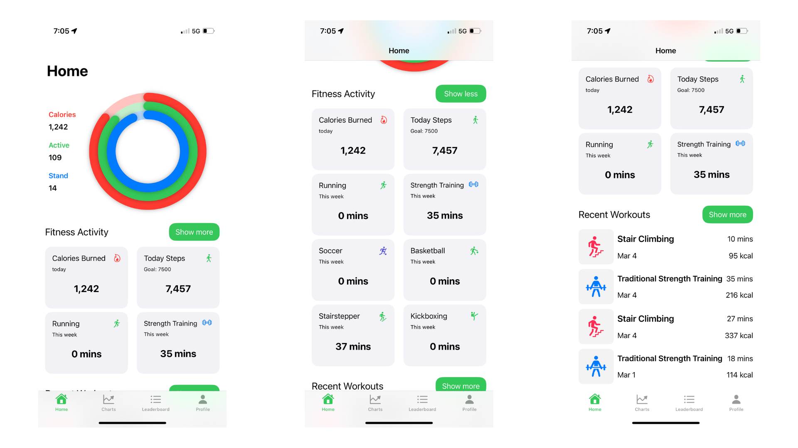
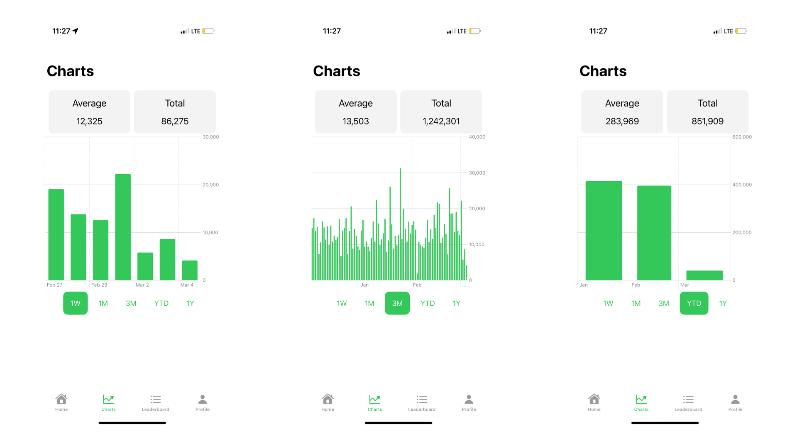
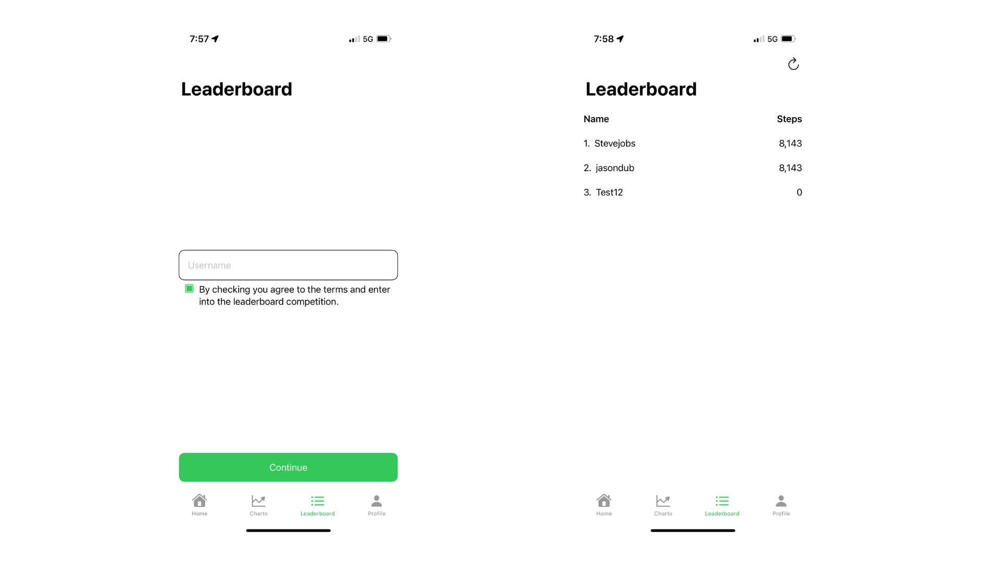
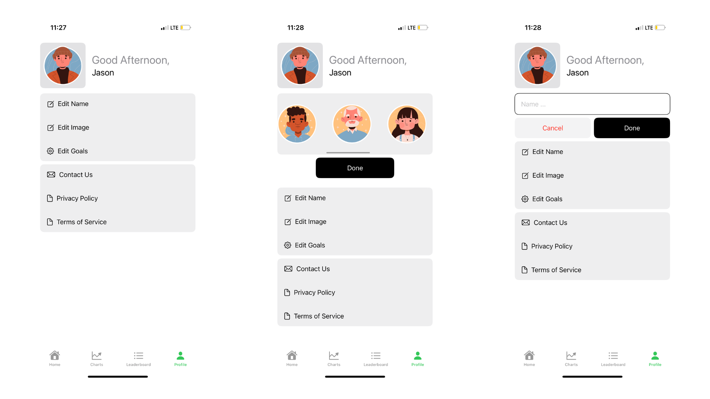

#  Be Fit

Be Fit is a fitness & activity tracking application where users can track their activity levels today and historical levels. It's built entirely in SwiftUI, making it fast, lightweight, and easy to use. 

You can connect your health data, browse your historic data, interact with other users, and post step updates.

## Getting Started

To run the Be Fit app locally, follow these steps:

1. Open `FitnessApp.xcodeproj` in Xcode.
2. Ensure you have the latest version of Xcode and SwiftUI.
3. Resolve Swift Packages Issues and ensure they are all installed.
4. Ensure the HealthKit entitlements are valid (requires Apple developer account).
5. Run the app in the Simulator or on a real device.

Requires: iOS 17+ & Xcode 15

## Features

### Home

* Track your daily activity levels of calories burned, active time, stand hours.
* Track your fitness activity.
* View your latest workouts.

### Charts

* Track your steps for the past week, month, and up to the previous 12 months.
* Insights on average step count during these periods.
* Get total step counts during a period.

### Leaderboard

* Enter our weekly step competition with first, second, third place winners.
* Upload your weekly step count to see how you compare with other users
* Winners are annouced each Sunday

### Profile

* Edit your profile, from your bio to your custom fields.
* Contact Us - Direct access to our inbox.
* Fully access to privacy settings and terms of service.

## A note on the architecture

The project is built following a straightforward Model-View-View Model (MVVM). The Health & Database Managers follow the singleton design pattern as single instance was sufficient and can still use dependency injection by injecting in initialization of view models. The project also incorporates Apple's new Observation framework (carried out a migration from Apple's old paradigm to this new one).

The app covers many of the basic concepts of SwiftUI, such as building layouts, working with data, and handling user interaction. By exploring the code, you can understand how to use SwiftUI, MVVM, HealthKit in your daily life. 

### Note on the project

This project was apart of the Pro iOS Dev Course I built for young iOS developers looking to level up their skills by learning and mastering MVVM, source control, in-app purchases, Firebase and HealthKit.

